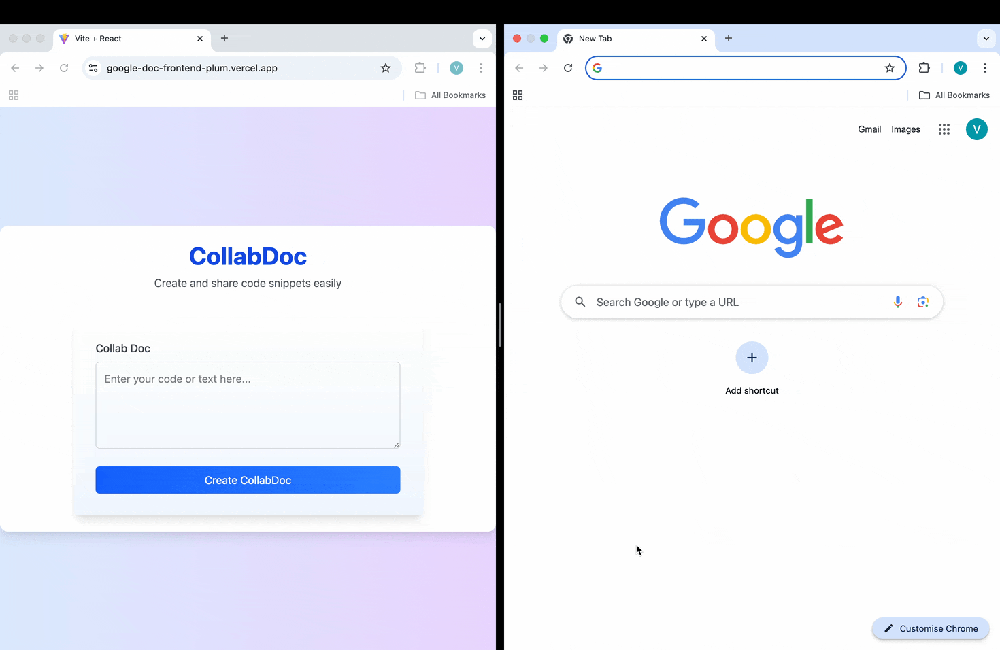

# 📄 Collaborative Document Editor

A **real-time collaborative text editor** built with **Spring Boot** (backend) and **React** (frontend). This editor supports concurrent editing, real-time updates using **WebSockets**, and conflict resolution using **CRDT** (Conflict-free Replicated Data Type). 

---

## 🚀 Features

- **Create, View, and Edit Documents**: Create text-based documents with real-time updates.
- **Real-Time Collaboration**: Changes from multiple users are synchronized instantly using **WebSockets**.
- **Persistence**: Edits are saved incrementally and periodically from in memory cache to avoid data loss.
- **CRDT for Conflict-Free Editing**: Ensures edits from different users merge seamlessly without conflicts.
- **Scalable Backend**: Built on **Spring Boot**, connected to **Postgres** for document storage.
- **Cache Disposal**: When all sessions get disconnected for a document, it is flushed into database to free up in-memory cache

---

## 🌐 Live Demo

[https://google-doc-frontend-plum.vercel.app](https://google-doc-frontend-plum.vercel.app)

---

## 🎥 Demo GIF

This shows 2 users simulaneously editing a document without countering each other's changes



---

## 📂 Project Structure

- **Backend**: Spring Boot application with REST APIs and WebSocket configuration.
- **Frontend**: React application for the editor interface.
- **Database**: Postgres for storing documents and edit history.

---

## 🛠️ Technologies Used

- **Backend**: Spring Boot, WebSockets, Postgres
- **Frontend**: React, Vite
- **Database**: Postgres
- **Version Control**: Git

---

## 🔧 Setup Instructions

### 1. **Clone the Repositories**
```bash
git clone --recurse-submodules https://github.com/vivagarwal/collab_doc.git
```

---

### 2. **Backend Setup (Spring Boot)**

1. Navigate to the backend directory:
    ```bash
    cd collab_doc_backend
    ```

2. Create a `.env` file in the root of the backend directory:
    ```plaintext
    POSTGRES_URL=jdbc:postgresql://localhost:5432/google_doc
    POSTGRES_USER=postgres
    POSTGRES_PASSWORD=postgres
    FRONTEND_URL=http://localhost:3000  # Or your frontend URL
    ```
    replace with appropriate values

3. Build and run the backend:
    ```bash
    ./mvnw clean install
    ./mvnw spring-boot:run
    ```

   The backend will be available at: `http://localhost:8080`

---

### 3. **Frontend Setup (React)**

1. Navigate to the frontend directory:
    ```bash
    cd collab_doc_frontend
    ```

2. Install dependencies:
    ```bash
    npm install
    ```

3. Create a `.env` file in the root of the frontend directory:
    ```plaintext
    VITE_BASE_URL=http://localhost:8080  # Backend URL
    ```

4. Start the frontend:
    ```bash
    npm run dev
    ```

   The frontend will be available at: `http://localhost:5173`

---

## 📑 API Endpoints

### **Document Management**
1. **POST** `/api/snippets/create`  
   Create a new document.

   **Request Body:**
   ```json
   {
     "content": "Initial content of the document"
   }
   ```

   **Response:**
   ```json
   {
     "id": "generatedId",
     "uniqueLink": "unique-link-id",
     "content": "Initial content of the document"
   }
   ```

2. **GET** `/api/snippets/view/{uniqueLink}`  
   Retrieve the content of a document.

   **Response:**
   ```json
   {
     "content": "Document content here"
   }
   ```

3. **PUT** `/api/snippets/update/{uniqueLink}`  
   Update document content.

   **Request Body:**
   ```json
   {
     "content": "Updated content"
   }
   ```

---

## 📡 WebSocket Configuration

- **WebSocket Endpoint**: `/ws/edit`
- **Topic Prefix**: `/topic/snippets`

---

## 🔍 Checkpoints & Development Progress

| **Checkpoint** | **Status** | **Description**                                                                 |
|----------------|------------|---------------------------------------------------------------------------------|
| Checkpoint 1   | ✅          | Basic document creation, storage, and retrieval through REST APIs              |
| Checkpoint 2   | ✅          | WebSocket setup for real-time document updates                                 |
| Checkpoint 3   | ✅          | Periodic persistence of document edits to the database                         |
| Checkpoint 4   | ✅          | Track cursor positions and handle character-level edits                        |
| Checkpoint 5   | ✅          | Implement CRDT for conflict-free real-time collaboration                       |
| Checkpoint 6   | 🔄          | Finalize a fully working MVP with persistence and conflict resolution using CRDT |

---

## 🛠️ CRDT Integration

The CRDT model ensures that changes from different users are merged correctly. The basic flow involves:
- Each edit operation is transformed into a **CRDT event**.
- Events are applied locally and broadcast to all connected users.
- Postgres stores the CRDT representation to maintain consistency across reloads.

---

## 🌱 Future Enhancements

- Rich text formatting
- Version history and rollback
- User authentication and access control
- Optimized CRDT-based storage

---

## 📬 Testing the Project

### Postman Collection:
Use the provided Postman collection to test REST endpoints and simulate API requests.

---

## 🤝 Contributing

Contributions are welcome! To contribute:
1. Fork the project.
2. Create a feature branch.
3. Submit a pull request.

---

## 📜 License

This project is licensed under the MIT License.

---

🎉 **Thank you for exploring Collaborative Document Editor! Happy Coding!**